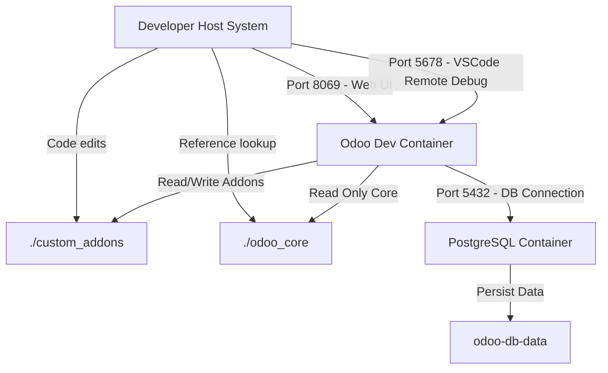

# Development Environment Architecture & Plan

## Overview
This document details the plan for setting up a dedicated Docker development container for testing and developing Odoo custom modules in [`custom_addons/`](custom_addons/).

## System Architecture



## Strategy & Best Practices

1. **Dedicated Dockerfile (`Dockerfile.dev`)**:
   - Extends base `odoo:${ODOO_VERSION}` (defaulting to 19.0).
   - Installs development CLI utilities: `git`, `postgresql-client`, `nano`, `vim`, `curl`.
   - Installs Python development, linting, and debugging dependencies: `debugpy`, `ipdb`, `pylint`, `pylint-odoo`, `flake8`, `black`, `coverage`, `pytest`.

2. **Compose Integration (`docker-compose.yml`)**:
   - Replaces static image pull with `build: context .` using `Dockerfile.dev`.
   - Mounts [`custom_addons/`](custom_addons/) to `/mnt/extra-addons` for live code updates.
   - Mounts [`odoo_core/`](odoo_core/) read-only for local code reference.
   - Exposes port `8069` (Web UI), `8072` (Longpolling/WebSockets), and `5678` (`debugpy` remote debugging).
   - Enables Odoo hot-reloading with flag `--dev=xml,reload,qweb,sql,werkzeug`.

3. **Proposed `Dockerfile.dev` Content**:
```dockerfile
ARG ODOO_VERSION=19.0
FROM odoo:${ODOO_VERSION}

USER root

# Install system dev tools and packages
RUN apt-get update && apt-get install -y --no-install-recommends \
    git \
    python3-pip \
    python3-dev \
    build-essential \
    postgresql-client \
    nano \
    vim \
    curl \
    && rm -rf /var/lib/apt/lists/*

# Install Python packages for linting, testing, and debugging
RUN pip3 install --no-cache-dir --break-system-packages \
    debugpy \
    ipdb \
    pylint \
    pylint-odoo \
    flake8 \
    black \
    coverage \
    pytest

ENV PYTHONUNBUFFERED=1

USER odoo
```

4. **Proposed `docker-compose.yml` Content**:
```yaml
services:
  web:
    container_name: odoo-web-dev
    build:
      context: .
      dockerfile: Dockerfile.dev
      args:
        ODOO_VERSION: ${ODOO_VERSION:-19.0}
    depends_on:
      - db
    ports:
      - "8069:8069"
      - "8072:8072"
      - "5678:5678"
    environment:
      - HOST=db
      - USER=${DB_USER}
      - PASSWORD=${DB_PASSWORD}
    command: odoo --dev=xml,reload,qweb,sql,werkzeug
    volumes:
      - odoo-web-data:/var/lib/odoo
      - ./custom_addons:/mnt/extra-addons
      - ./odoo_core:/opt/odoo/odoo_core:ro
    restart: unless-stopped

  db:
    container_name: odoo-db-dev
    image: postgres:16
    environment:
      - POSTGRES_DB=${POSTGRES_DB}
      - POSTGRES_USER=${DB_USER}
      - POSTGRES_PASSWORD=${DB_PASSWORD}
      - PGDATA=/var/lib/postgresql/data/pgdata
    volumes:
      - odoo-db-data:/var/lib/postgresql/data/pgdata
    restart: unless-stopped

volumes:
  odoo-web-data:
  odoo-db-data:
```
